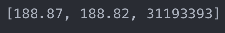
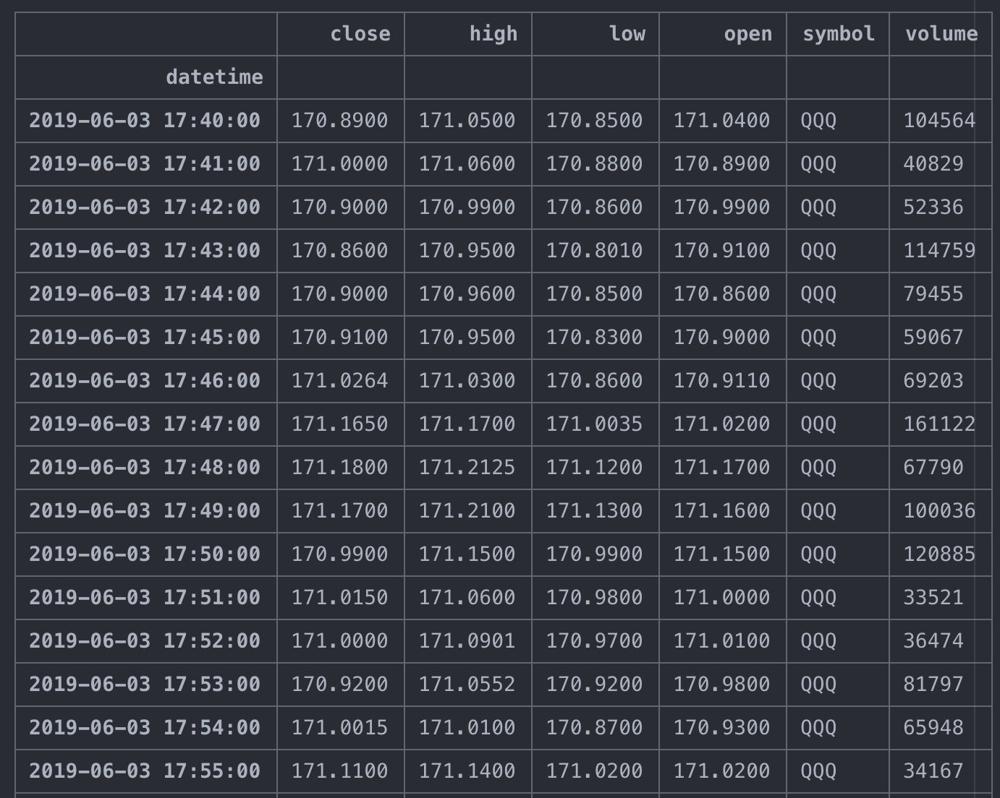
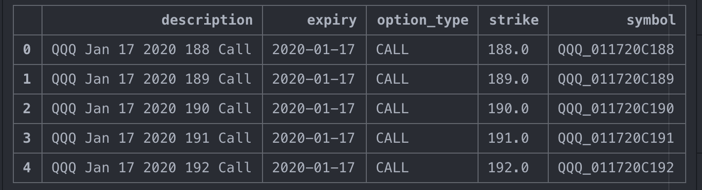
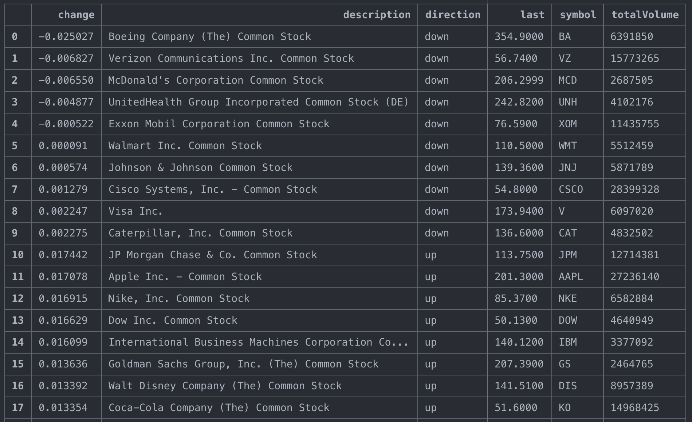

[](https://github.com/Naereen/StrapDown.js/blob/master/LICENSE)


# tdlink
Python Library for TDAmeritrade API

All the dates and times are in UTC.

<h3> Authentication </h3>

**NOTE:** Please make sure you obtain a code or refresh token from TDAmeritrade before using this library.

Follow these steps to get a code:

1) Go to TDAmeritrade developer: https://developer.tdameritrade.com/</br>
2) Login and go to "My Apps" </br>
3) Create an app. Use http://localhost as the callback url.</br>
4) Go to this url: https://auth.tdameritrade.com/auth?response_type=code&redirect_uri=http://localhost&client_id=[YourAppName]@AMER.OAUTHAP </br>
5) Enter your TD credentials and give premission </br>
6) Once you login, you will be redirected to a url of this form https://localhost/?code=[code] </br>
7) Copy the [code] part. Add it as a parameter to the TDAmeritrade class. </br>
8) The TDAmeritrade class should now work!

**NOTE:** The code you obtain is only valid for a limited period of time. If expired, follow steps again to get a new code.


<h3> Installation </h3>

<h4> From PyPI </h4>

```
pip install tdlink
```

<h4> From Source </h4>

```
pip install --upgrade git+git://github.com/ysriram1/tdlink
```

<h3> Examples </h3>

<h4> Connect to the API </h4>

```python
from tdlink import TDlink

td = TDlink(app_key='TRADING123',
                redirect_uri='http://localhost',
                code=code, # follow instructions to get the code
                return_raw_response=False # will return formatted df if False, else returns HTTP response
                )
```

<h4> Get the refresh and access tokens </h4>

```python
td.refresh_token # returns refresh token

td.access_token # returns the access token
```

*Note:* You can save the refresh token for creating a future session instead of using a code.

<h3> Get Data from API </h3>

<h4> Current Quote </h4>
```python
td.get_current_quote(symbol='QQQ',
          to_return=['askPrice', 'bidPrice', 'totalVolume'])
```
<div></div>

*NOTE:* Use this also for prices of options.

<h4> Historical Data </h4>

```python
td.get_historical_prices(symbol='QQQ',
                    period_type='day', # 'day'
                    period=2, # day: 1, 2, 3, 4, 5, 10* month: 1*, 2, 3, 6 year: 1*, 2, 3, 5, 10, 15, 20 ytd: 1*
                    frequency_type='minute', # day: minute* month: daily, weekly* year: daily, weekly, monthly* ytd: daily, weekly*
                    frequency=5, # minute: 1*, 5, 10, 15, 30 daily: 1* weekly: 1* monthly: 1*
                    start_date='06/03/2019', # mm/dd/yyyy
                    start_time=None, # hh:mm:ss
                    end_date='06/04/2019',
                    end_time=None,
                    extended_hours=True,
                    return_df=True # if False, returns a dictionary instead
                    )
```

<div></div>

<h4> Options Chain </h4>

```python
td.get_options_chain(symbol='QQQ', # symbol of underlying security
                    strike=None, # mention a specific strike
                    from_date='01/01/2020', # only expirations after this date (mm/dd/yyyy)
                    from_time=None,
                    to_date='01/30/2020', # only expirations before this date
                    to_time=None,
                    expiry_month='ALL', # option expiry month ALL or JAN
                    kind='OTM', # ITM, NTM, OTM, SAK (Strikes Above Market), ALL etc.
                    include_quotes=False, # if FALSE only returns the option names (use get_current_quote() to get value)
                    contract_type='CALL', # CALL, PUT
                    strikes=5, # number of strikes above or below at-the-money price
                    strategy='SINGLE',
                    return_df=True # if False, returns a dictionary instead
                    )
```

<div></div>


<h4> Top Movers of an Index </h4>

```python
td.get_movers_for_index(symbol = 'DJI', # has to be an index DJI, SPX.X  etc
                        direction = None, # 'up' or 'down'. if None, returns both
                        change = None # 'value' or 'percent'. if None, defaults to percentage
                        )
```

<div></div>


<h3> Support </h3>

Please email me at ysriram@umich.edu if you have any questions, suggestions, or ideas for improvement. 
